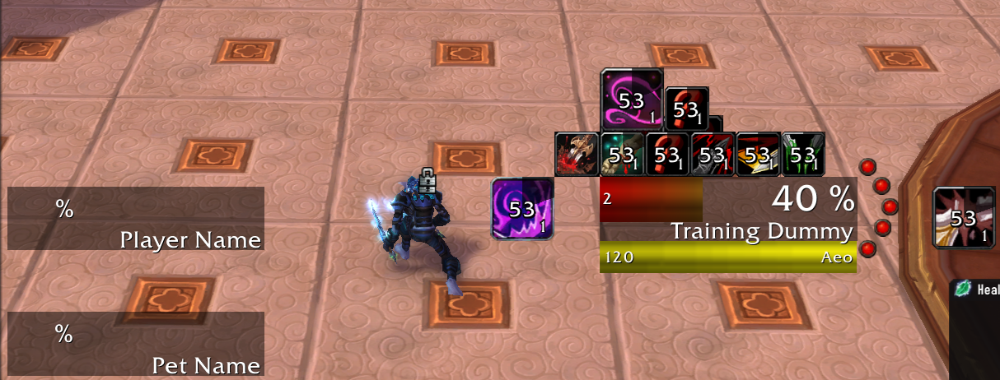
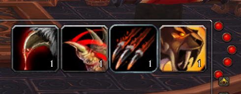
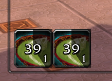

# mop

## Weakauras for Mist of Pandaria Classic

### Aeo's Weakauras

Aeo's Weakauras are a full kit to track buffs/debuffs and combo points for a rogue.  It was then extended to cover some simple debuff tracking for DK's and Feral druids, and hunters.

>[!NOTE]
>There are self, pet, and target frames for health.  The pet and self frames only appear if you they are less than full health.  Both buff and debuff tracking are on the target unit.  It doesn't make a lot of sense with the default UI to scan over to MY character upper left to see how many combo points or if I have slice and dice up, and then scan the target unit frame to see if I have rupture or other debuffs.  So the overall design is to only have to stare mostly at the target UNIT weakaura and you'll see everything.

It has some layover from cataclysm as well for tracking procs from `Fangs of the Father` legendary daggers, and a `backstab below 35% health` icon you'll see there a bit to the left.

### Beginner Feral

Is designed for feral newbies to simply keep track of:
- Rake
- Mangle
- Rake
- Savage Roar
- Combo Points

The mangle part is a little strange because mangle applies `Infectous Wounds` so the icon doesn't match the actual debuff name.

This is only intended for absolute beginners and should be replaced when they understand more about the game.

### Jikun

The Ji'Kun fight is simple enough, and all I wanted was a way to make sure I got the buff from `Feed Young`, which grants stacks of what is called `Primal Nutriment`, and there two distinct SpellID's to track for this, instead of a stack you get separate distinct buffs.  This is a very simple weakaura that you can place anywhere.